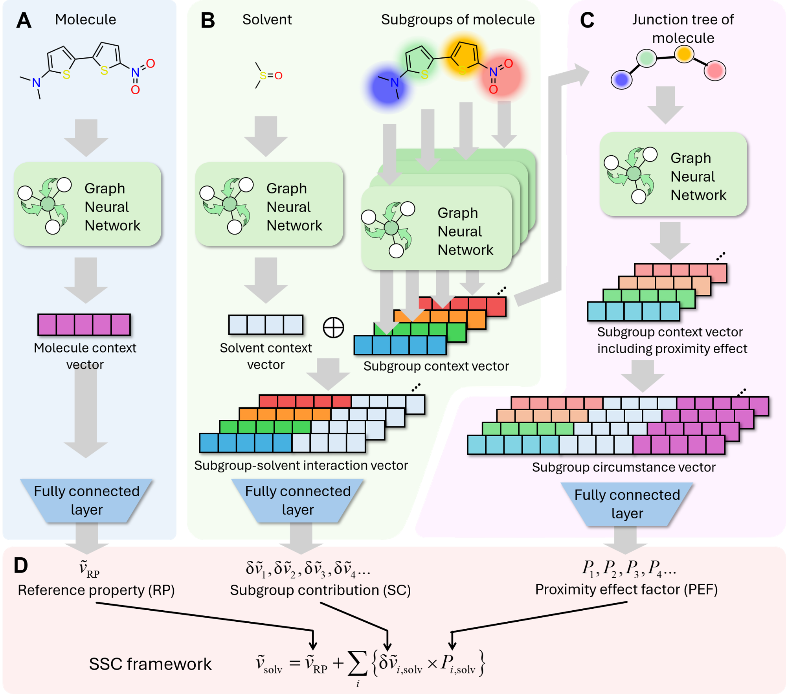

# Solvatochromic Subgroup Contribution (SSC) 
[](https://opensource.org/licenses/MIT)

This repository provides a graph neural network for molecular property prediction, reflecting the idea of "Solvatochromic subgroup contribution". In the approach of SSC, the solvent effects on the molecular property can be quantified by the contirbution of consisting functional groups. 

SSC now runs on [D4CMPP2](https://github.com/ACCA-KU/D4CMPP2), PyTorch, and
PyTorch Geometric (PyG). The public `SSC.train` and `SSC.Analyzer` entry points
remain available, while graph generation, batching, training, and saved-model
loading use the D4CMPP2 contracts.

<p align="center">
  
</p>

## Installation
```bash
pip install git+https://github.com/ACCA-KU/SSC.git
```
or
```bash
git clone https://github.com/ACCA-KU/SSC.git
cd SSC
pip install -e
```

Python 3.10 or newer is required. Install D4CMPP2 and its PyG/RDKit runtime in
the same environment. DGL is no longer required.


## Quick Start
```python
from SSC import Analyzer, train

model_path = train(
    data="data/SciData_emi.csv",
    target=["Emi_eV"],
    network="SSC",
    device="cpu",
    max_epoch=2,
    batch_size=8,
)

analyzer = Analyzer(model_path, device="cpu")
prediction = analyzer.predict(["CCO"], ["O"])
scores = analyzer.get_score("CCO", "O")
```
"example.ipynb" provides the example codes for training and prediction of sample dataset.

This single command automatically supports the all steps of trainning model, including preprocessing, trainning, and logging the result.

The migrated PyG implementations retain these network IDs:

`SSC`, `SSC_GCN`, `SSC_MPNN`, `SSC_DMPNN`, `SSC_AFP`, `SSConlyPE`,
`SSCwoPE_GCN`, `SSCwoPE_MPNN`, `SSCwoPE_DMPNN`, and `SSCwoPE_AFP`.
The historical `SSCwoPE-2` ID is an alias of `SSCwoPE_GCN`.

Importing `SSC` also makes these external models available to D4CMPP2 entry
points and optimization tooling; no D4CMPP2 source modification is required.

CSV files must contain `compound`, `solvent`, and the requested target columns.

Models and graph caches created by the former D4CMPP/DGL backend are not loaded
or converted automatically. Retrain them with this PyG version, or keep the
historical D4CMPP/DGL environment when exact legacy artifacts are required.

See the [D4CMPP2 documentation](https://github.com/ACCA-KU/D4CMPP2) for the
shared training options, saved artifacts, and Analyzer behavior.
